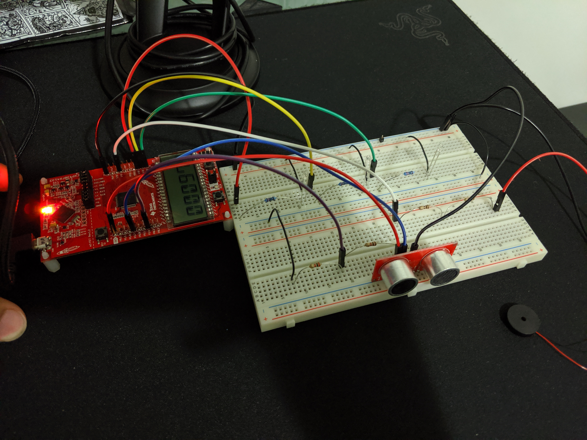
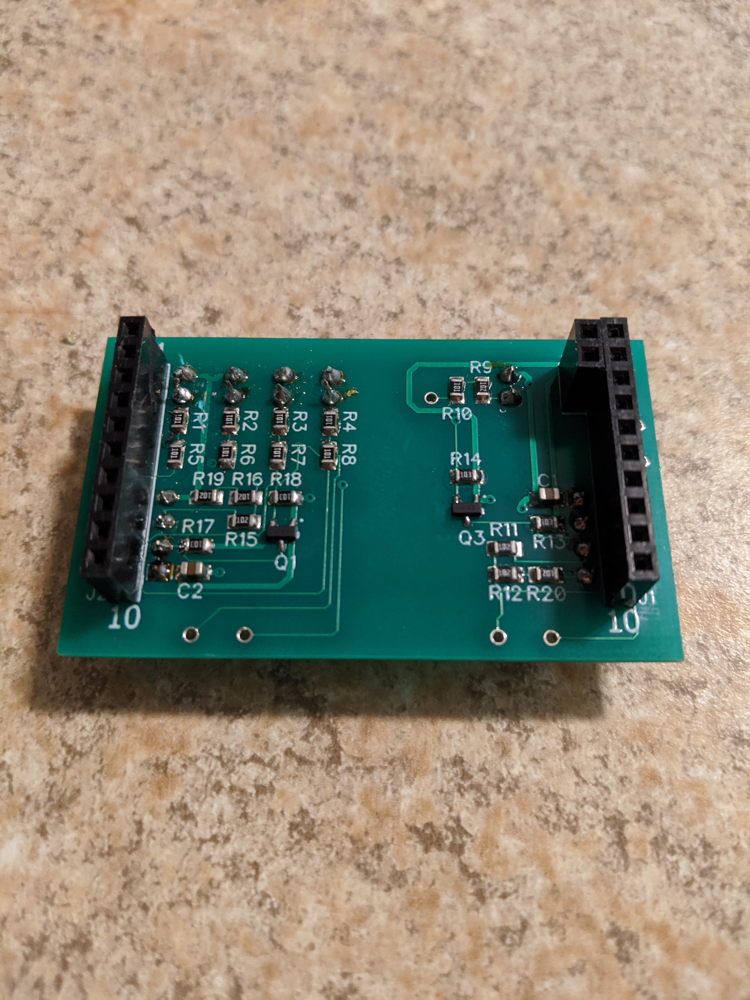

### Overview

An embedded system that solves the problem of detecting and warning cyclists of nearby hazards as well as warning
pedestrians of approaching cyclists. The solution consists of the single MSP430 microcontroller connected
to proximity sensors, a buzzer, and four LED indicators. The buzzer is used to warn front traffic of incoming
cyclists while the LEDs and an LCD are used to warn the cyclists of hazards approaching them from behind.

Please see the images at the end of the README :)

### Harware Components

- 1 Custom designed PCB
- 1 TI MSP 430 microcontroller
- 2 ultrasonic distance sensors
- 4 LEDs (red, orange, yellow, green)
- Audio piezo buzzer
- 7 100 Ohm, 3 1K Ohm, and 1 2K Ohm resistor(s)
- 2 N-Channel MOSFETs + necessary resistors and capacitors for stepping up and stepping down voltage between 3.3V and 5V

### Software

The project was programmed using the C programming language and compiled + flashed using Code Composer Studio. The program logic is contained in `main.c` and `main.h`.

The `hal_LCD.c` and `hal_LCD.h` files contain code for interfacing with the LCD display of the microcontroller.

The `driverlib` folder contains header files for interfacing with the microcontroller's I/O and on-board components.

The `targetConfigs` folder contains target-configuration (.ccxml) files, automatically generated based
on the device and connection settings specified in the project.

### Documentation

See `docs/pcb_circuit.dch` to view the circuit for the PCB.

See `docs/pcb_design.dip` to view the PCB design and layout.

### Images

Initial Design:

PCB:

Prototype:

